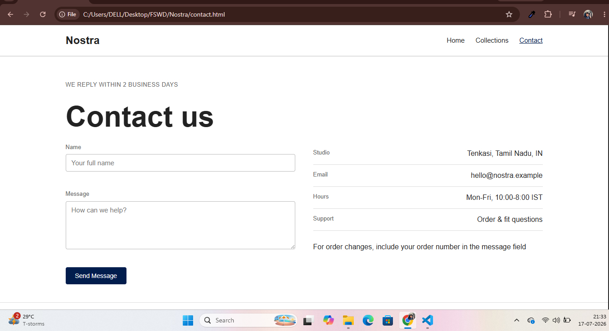
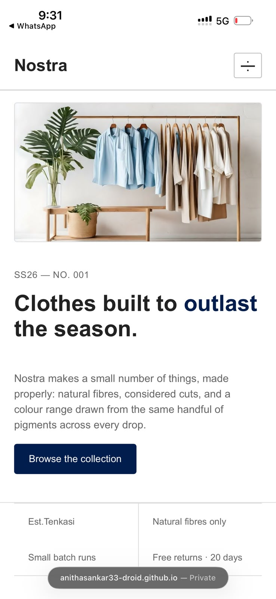
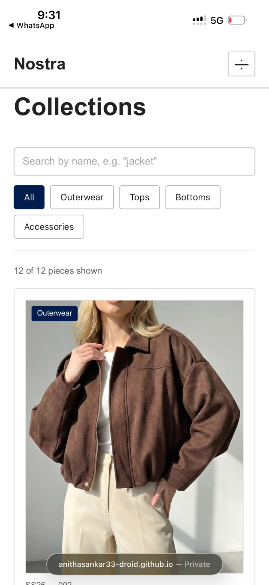

# Nostra — Considered Clothing

A modern, responsive multi-page website for **Nostra**, a fictional slow-fashion clothing brand. Built with HTML5, CSS3, and vanilla JavaScript, the site features dynamic product rendering, live search and filtering, and a clean, elegant UI across desktop and mobile.

**Live Demo:** [anithasankar33-droid.github.io/Nostra-Website](https://anithasankar33-droid.github.io/Nostra-Website/)

---

## Overview

Nostra presents a premium clothing collection across three pages, combining a considered visual design with practical front-end functionality: dynamic product rendering, category filtering, live search, and form validation — all implemented without a framework.

---

## Screenshots

### Desktop

| Home | Collections | Contact |
|------|-------------|---------|
|  |  |  |

### Mobile

| Home | Collections | Contact |
|------|-------------|---------|
|  |  |  |

---

## Pages

| Page | File | Description |
|------|------|-------------|
| Home | `index.html` | Hero banner, brand story, featured collections, craftsmanship section |
| Collections | `collections.html` | Product catalogue with live search and category filters |
| Contact | `contact.html` | Contact form with client-side validation and studio information |

---

## Features

- Fully responsive design across desktop, tablet, and mobile
- Mobile navigation menu (hamburger)
- Live product search
- Category filter chips
- Dynamic product rendering from a JavaScript data array
- Client-side contact form validation
- Modern, minimal fashion-forward UI
- Framework-free — fast and lightweight

---

## Tech Stack

- HTML5
- CSS3 (Flexbox, Grid)
- Vanilla JavaScript

---

## Project Structure

```text
Nostra-Website/
├── index.html
├── collections.html
├── contact.html
├── style.css
├── script.js
├── image/
└── README.md
```

---

## Getting Started

Clone the repository:

```bash
git clone https://github.com/anithasankar33-droid/Nostra-Website.git
```

Open the project folder and launch `index.html` directly in your browser, or run a local server:

```bash
# Python
python3 -m http.server 8000

# Node.js
npx serve .
```

Then visit `http://localhost:8000`.

---

## Highlights

- Shared CSS and JavaScript across all pages for consistency and maintainability
- Product data managed centrally as a JavaScript array, rendered dynamically to the DOM
- Search supports matching by product name, fabric, or category
- Responsive layouts built with Flexbox and CSS Grid
- Clean, modular, and reusable code structure

---

## Roadmap

Potential next steps for future iterations:

- Add a product detail page/modal
- Persist filter/search state via URL query parameters
- Introduce a lightweight build step (e.g. bundling, minification) for production
- Add automated accessibility and cross-browser testing

---

## Contact

For suggestions or feedback, feel free to open an issue or fork the repository.

---

## License

This project was created for educational and portfolio purposes.
