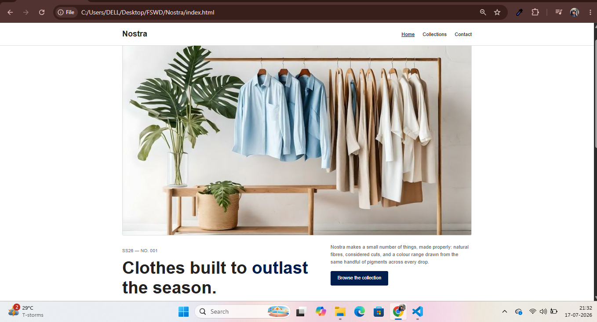
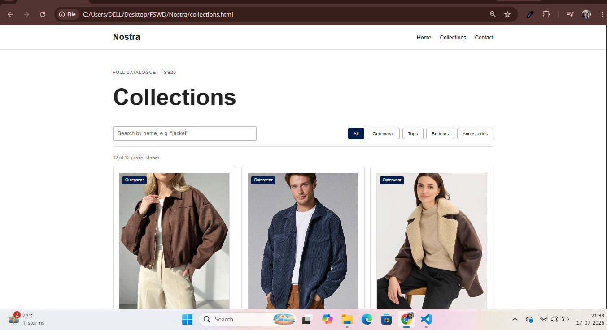

# 👕 Nostra — Considered Clothing

A modern, responsive multi-page clothing website for **Nostra**, a fictional slow-fashion fashion brand. This project is built using **HTML5, CSS3, and Vanilla JavaScript** without any frameworks or build tools.

🔗 **Live Demo:** ** **(https://anithasankar33-droid.github.io/Nostra-Website/)

---

# 📸 Screenshots

| Home | Collections |
|------|-------------|
|  |  |

| Contact | Mobile Home |
|---------|-------------|
|  |  |

| Mobile Contact | Mobile Collections |
|----------------|--------------------|
|  |  |

---

# ✨ Features

### 🏠 Home Page

* Modern hero section
* Brand highlights
* Featured products showcase

### 🛍️ Collections Page

* Dynamic product catalogue
* Live search by:

  * Product name
  * Fabric
  * Category
* Category filter buttons
* Real-time product counter
* "No products found" message

### 📩 Contact Page

* Client-side form validation
* Inline error messages
* Success confirmation message
* Responsive contact layout

### 📱 Responsive Design

* Mobile-friendly navigation
* Hamburger menu
* Flexible Grid & Flexbox layouts
* Tablet and mobile breakpoints

### ⚡ Dynamic Product Rendering

All products are stored inside a single JavaScript array and rendered dynamically. Adding a new product only requires creating one new object—no HTML changes are needed.

---

# 🛠️ Technologies Used

* HTML5
* CSS3
* Vanilla JavaScript (ES6)
* CSS Grid
* Flexbox
* Media Queries

---

# 📂 Project Structure

```text
nostra/
│
├── index.html              # Home page
├── collections.html        # Products page
├── contact.html            # Contact page
├── style.css               # Website styles
├── script.js               # Navigation, filtering & validation
└── image/                  # Images and assets
```

---

# 🚀 Getting Started

### Clone the repository

```bash
git clone https://github.com/anithasankar33-droid
```

### Open the project

Simply open **index.html** in your browser.

Or run a local development server:

```bash
python -m http.server 8000
```

Then visit:

```text
http://localhost:8000
```

You can also use the **Live Server** extension in Visual Studio Code.

---

# 🔍 Product Filtering

The collections page uses a single JavaScript `PRODUCTS` array.

Each product contains:

* ID
* Name
* Category
* Fabric
* Price
* Image

Products are filtered instantly without refreshing the page.

---

# 📬 Contact Form Validation

The contact form includes basic client-side validation.

Validation Rules:

* Name must contain at least 2 characters.
* Message must contain at least 10 characters.

After successful validation, the form displays a success message and resets automatically.

> **Note:** This is a front-end project only. No backend or database is connected.

---

# 📈 Future Improvements

* Backend integration for contact form
* Product detail page
* Shopping cart functionality
* Wishlist
* Dark mode
* Product sorting
* Pagination
* User authentication

---

# 📄 License

This project is open source and created for learning and portfolio purposes.

Feel free to use it as a reference or customize it for your own projects.

---

## 👨‍💻 Author

**Anii**

Built with ❤️ using **HTML, CSS, and JavaScript**.
